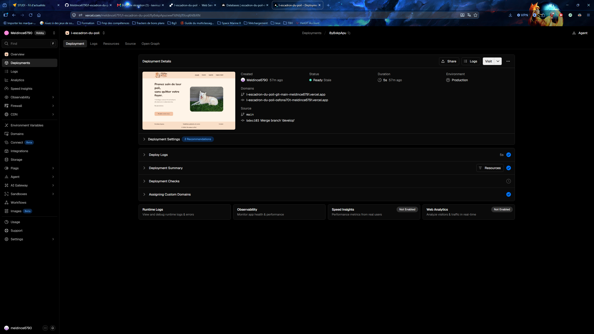
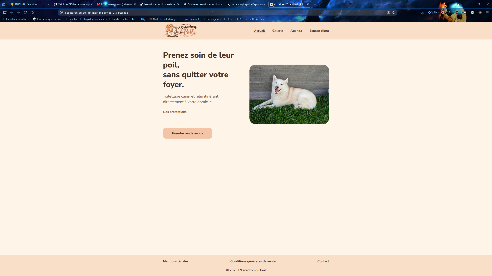
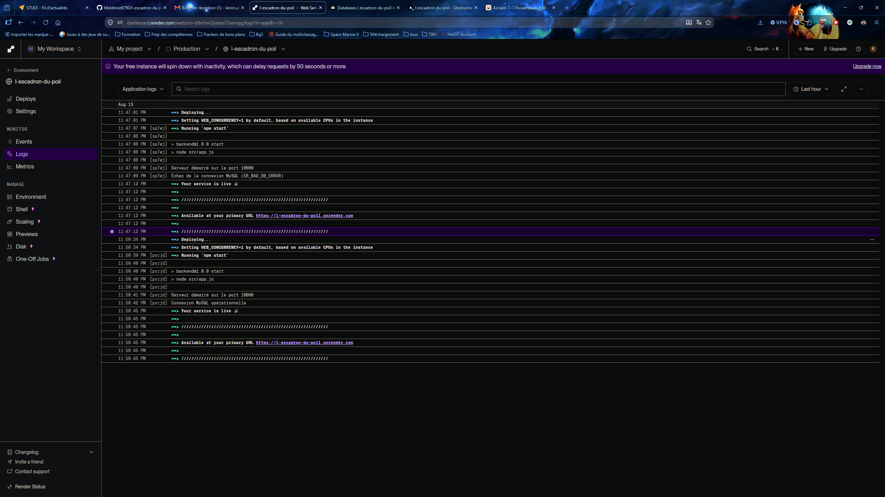
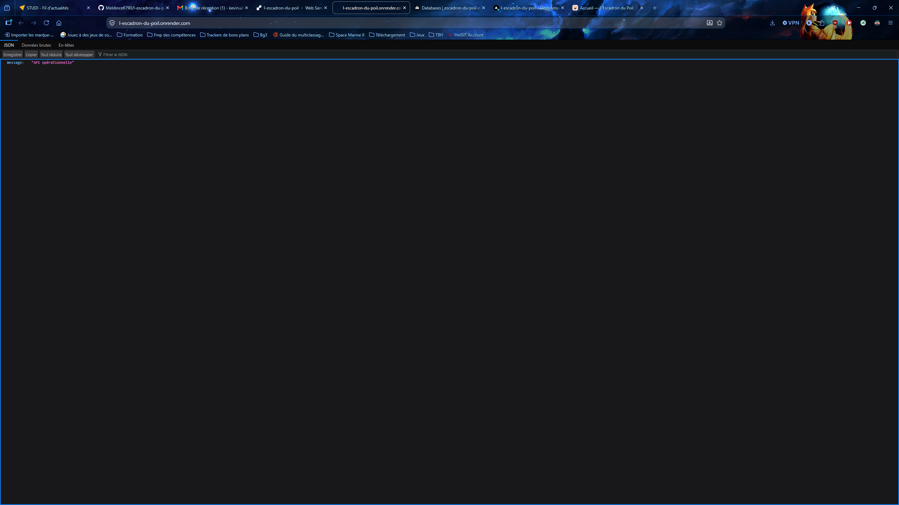
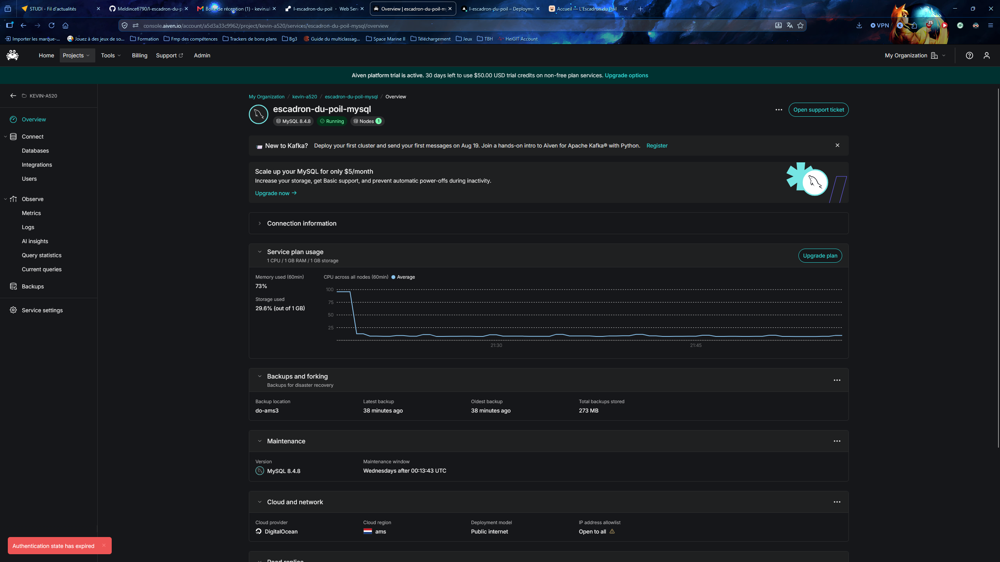

# Documentation technique de déploiement

**Projet :** L'Escadron du Poil  
**Application :** vitrine et prise de rendez-vous pour un service de toilettage canin et félin itinérant  
**Dépôt GitHub :** [https://github.com/Meldince6790/l-escadron-du-poil](https://github.com/Meldince6790/l-escadron-du-poil)

Ce document décrit le déploiement réel de l'application, tel qu'il est mis en œuvre dans le dépôt et sur les plateformes d'hébergement utilisées. Il sert également de support à la compétence C8 : *Documenter le déploiement d'une application dynamique web ou web mobile*.

Le frontend (Vercel), le backend (Render) et la base MySQL (Aiven) ont été déployés afin de réaliser, tester et documenter la mise en production. Ces services n'ont pas vocation à rester nécessairement actifs après validation du projet. Les plateformes ont généré des URL HTTPS publiques lors du déploiement ; elles ne sont pas consignées ici. Les captures d'écran des sections 7, 9 et 10 conservent la preuve du déploiement et des tests réalisés.

---

## 1. Objectif de la documentation

Cette documentation permet de :

- comprendre l'architecture de déploiement (frontend, backend, base de données) ;
- reproduire l'environnement de développement local avec Docker Compose ;
- déployer le frontend sur Vercel et le backend sur Render ;
- configurer la connexion MySQL distante (Aiven) de façon sécurisée (TLS) ;
- vérifier le bon fonctionnement après mise en production ;
- documenter les incidents rencontrés et leurs corrections ;
- redéployer ou mettre à jour l'application sans exposer de secrets.

Elle ne décrit pas de fonctionnalités métier absentes du code (authentification, réservation persistée, communication frontend ↔ API).

---

## 2. Architecture de déploiement

### 2.1 Production

L'application est composée de trois blocs déployés séparément. Le navigateur accède au frontend et au backend de façon indépendante.

```text
Navigateur
    │
    ├──────────────► Frontend React / Vite
    │                    Vercel
    │
    └──────────────► Backend Node.js / Express
                         Render
                           │
                           │ TLS
                           ▼
                       MySQL / Aiven
```

Frontend ↔ Backend : aucune communication implémentée à ce stade.

| Composant | Technologie | Hébergement production | Rôle actuel |
|---|---|---|---|
| Frontend | React, Vite, JavaScript, React Router | Vercel | Interface (Accueil, Galerie, Agenda, Espace client) |
| Backend | Node.js, Express 5, CommonJS, mysql2 | Render | API minimale (`GET /`) et vérification de connexion MySQL |
| Base de données | MySQL 8 | Aiven (offre gratuite disponible lors du déploiement) ; service Docker `mysql:8.4` en local | Stockage ; aucune table métier n'est créée à ce stade |

**État d'intégration :** le frontend et le backend sont déployés indépendamment. Le code frontend ne contient aucun appel HTTP vers l'API. La connexion Render → Aiven est en revanche validée.

### 2.2 Environnement local (Docker Compose)

L'environnement local n'est pas l'architecture de production. Il orchestre frontend, backend et MySQL sur un même réseau Docker, pour le développement.

```text
Environnement local (Docker Compose)
    frontend :5173
    backend  :3000  →  mysql :3306
    réseau dédié `escadron`
```

Les trois services locaux partagent le réseau Compose. Cela ne signifie pas qu'une communication frontend ↔ backend soit implémentée dans le code React.

---

## 3. Prérequis

### Outils locaux

- Docker et Docker Compose
- Node.js compatible avec le frontend Vite (le Dockerfile utilise l'image `node:22-bookworm-slim`)
- Git
- Un navigateur web

### Comptes et plateformes

- Compte GitHub avec accès au dépôt
- Compte Vercel (frontend)
- Compte Render (backend)
- Compte Aiven (MySQL)

### Fichiers du dépôt utiles au déploiement

| Fichier | Rôle |
|---|---|
| `docker-compose.yml` | Orchestration locale (frontend, backend, mysql) |
| `.env.example` | Modèle des variables d'environnement, sans secret |
| `.env` | Valeurs locales (ignoré par Git, à créer à partir de `.env.example`) |
| `frontend/Dockerfile` | Image de développement Vite |
| `backend/Dockerfile` | Image de développement Express |
| `frontend/vercel.json` | Rewrite SPA pour Vercel |
| `backend/src/config/database.js` | Pool MySQL et TLS optionnel |
| `backend/src/app.js` | Serveur Express et vérification MySQL au démarrage |

---

## 4. Organisation Git et branche de production

| Élément | Valeur |
|---|---|
| Dépôt distant | `https://github.com/Meldince6790/l-escadron-du-poil.git` |
| Branche de production | `main` |
| Branche d'intégration | `develop` |

Le frontend Vercel et le backend Render sont configurés pour se déployer depuis **`main`**.

Le workflow Git est géré manuellement. Les secrets (fichier `.env`, certificats `*.pem` / `*.crt` / `*.key`, dossier `certs/`) sont exclus via `.gitignore`.

---

## 5. Variables d'environnement

### 5.1 Backend en production (Render)

Ces variables sont lues par `backend/src/config/database.js` et `backend/src/app.js`.

| Variable | Rôle | Exemple de placeholder |
|---|---|---|
| `PORT` | Port d'écoute HTTP | fourni automatiquement par Render |
| `DB_HOST` | Hôte MySQL | `<hôte Aiven>` |
| `DB_PORT` | Port MySQL | `<port Aiven>` |
| `DB_USER` | Utilisateur MySQL | `<utilisateur Aiven>` |
| `DB_PASSWORD` | Mot de passe MySQL | `<mot de passe Aiven>` |
| `DB_NAME` | Nom de la base | `<nom de la base Aiven>` |
| `DB_CA_PATH` | Chemin du certificat CA (Secret File Render) | `<chemin du Secret File>` |

`DB_PORT` vaut `3306` par défaut dans le code si la variable est absente. En production Aiven, le port réel doit être renseigné.

Lorsque `DB_CA_PATH` est défini, le backend active TLS (`rejectUnauthorized: true`). S'il est absent, aucune option SSL n'est envoyée (cas Docker local).

### 5.2 Environnement local (Docker Compose)

Le fichier `.env` (non versionné) alimente le service MySQL Docker. Le backend reçoit ensuite ces valeurs via `docker-compose.yml` :

| Variable Compose (fichier `.env`) | Variable injectée au backend |
|---|---|
| `MYSQL_DATABASE` | `DB_NAME` |
| `MYSQL_USER` | `DB_USER` |
| `MYSQL_PASSWORD` | `DB_PASSWORD` |
| — | `DB_HOST=mysql` (nom du service Docker) |
| — | `DB_PORT=3306` |
| — | `PORT=3000` |

`MYSQL_ROOT_PASSWORD` sert uniquement au service MySQL Docker (healthcheck et initialisation). Il n'est pas passé au backend.

Le modèle sans secret est `.env.example`.

**À renseigner manuellement dans `.env` local :** `MYSQL_USER`, `MYSQL_PASSWORD`, `MYSQL_ROOT_PASSWORD`.

---

## 6. Déploiement de l'environnement local avec Docker Compose

### 6.1 Préparation

À la racine du projet :

```bash
cp .env.example .env
```

Compléter `.env` avec des valeurs locales (pas les identifiants de production).

### 6.2 Construction et démarrage

```bash
docker compose config
docker compose build
docker compose up -d
docker compose ps
```

Services attendus :

| Service | Image | Port hôte |
|---|---|---|
| `frontend` | build local (`node:22-bookworm-slim`) | 5173 |
| `backend` | build local (`node:22-bookworm-slim`) | 3000 |
| `mysql` | `mysql:8.4` | 3306 |

Caractéristiques réelles du compose :

- réseau Docker nommé `escadron` (réseau créé : `escadron-du-poil_escadron`) ;
- volume persistant MySQL : `escadron-du-poil_mysql_data` ;
- volumes `node_modules` : `escadron-du-poil_frontend_node_modules` et `escadron-du-poil_backend_node_modules` ;
- bind mounts du code `./frontend` et `./backend` ;
- healthcheck MySQL ; le backend ne démarre qu'une fois MySQL `healthy` ;
- Vite est lancé avec `--host 0.0.0.0 --port 5173` ;
- le backend utilise le script `npm run dev` (`node --watch src/app.js`).

### 6.3 Vérifications locales

Frontend :

```bash
curl http://localhost:5173/
```

Backend :

```bash
curl http://localhost:3000/
```

Réponse attendue :

```json
{"message":"API opérationnelle"}
```

Journaux backend attendus :

```text
Serveur démarré sur le port 3000
Connexion MySQL opérationnelle
```

```bash
docker compose logs backend
docker compose logs mysql
```

---

## 7. Déploiement du frontend sur Vercel

Configuration confirmée :

| Paramètre | Valeur |
|---|---|
| Plateforme | Vercel |
| Root Directory | `frontend` |
| Framework Preset | Vite |
| Branche | `main` |
| HTTPS | fourni par Vercel |

Le build de production correspond au script du `frontend/package.json` :

```bash
npm run build
```

soit `vite build`.

Lors du déploiement, Vercel a généré une URL HTTPS publique. Cette URL n'est pas consignée dans le dépôt : le service peut être désactivé après validation du projet. Les captures ci-dessous conservent la preuve du déploiement.



*Figure 1 — Tableau de bord Vercel : déploiement du frontend abouti au statut Ready / Production, depuis la branche `main`.*



*Figure 2 — Application frontend servie en HTTPS : page d'accueil accessible publiquement après déploiement.*

---

## 8. Configuration du routage SPA sur Vercel

Le frontend utilise `BrowserRouter` (React Router) avec les routes :

- `/`
- `/galerie`
- `/agenda`
- `/espace-client`

Vercel sert des fichiers statiques. Sans fallback, une URL comme `/agenda` est interprétée comme un fichier manquant.

Le fichier `frontend/vercel.json` corrige ce comportement :

```json
{
  "rewrites": [
    {
      "source": "/(.*)",
      "destination": "/index.html"
    }
  ]
}
```

Toutes les routes sont ainsi servies par `index.html`, puis React Router affiche la page correspondante.

Voir aussi la section 14 (incident Vercel).

---

## 9. Déploiement du backend sur Render

Configuration confirmée :

| Paramètre | Valeur |
|---|---|
| Plateforme | Render |
| Root Directory | `backend` |
| Branche | `main` |
| Build Command | `npm ci` |
| Start Command | `npm start` |
| Port | `process.env.PORT` (fourni par Render) |
| HTTPS | fourni sur l'URL publique Render |

`npm start` exécute `node src/app.js` (`backend/package.json`).

Lors du déploiement, Render a généré une URL HTTPS publique. Cette URL n'est pas consignée dans le dépôt : le service peut être désactivé après validation du projet. Les captures ci-dessous conservent la preuve du déploiement et des tests.

Variables d'environnement à déclarer dans le tableau de bord Render : voir section 5.1. Ne jamais coller les valeurs réelles dans ce document.

Pour une vérification reproductible de l'API, remplacer le placeholder par l'URL fournie par Render au moment du test :

```bash
curl <URL Render>/
```



*Figure 3 — Journaux Render du backend : message `Connexion MySQL opérationnelle`, sans identifiant ni mot de passe.*



*Figure 4 — URL publique de l'API Render : la route `GET /` répond `{"message":"API opérationnelle"}`.*

---

## 10. Configuration de la base MySQL sur Aiven

| Paramètre | Valeur |
|---|---|
| Fournisseur | Aiven |
| Offre | offre gratuite disponible lors du déploiement (période d'essai également affichée dans l'interface ; conditions non garanties dans la durée) |
| Moteur | MySQL |
| Usage | connexion distante depuis Render |

Le nom de base attendu par le projet est celui configuré dans `DB_NAME` sur Render. Il doit correspondre **exactement** au nom réel de la base Aiven (voir incident section 14).

Aucune table métier n'est créée par le code actuel. Le backend exécute uniquement `SELECT 1` au démarrage.

Identifiant, hôte, port et mot de passe : à récupérer dans la console Aiven et à reporter uniquement dans Render, jamais dans Git.

Le service Aiven peut être arrêté après validation. La capture ci-dessous conserve la preuve de son état au moment des tests.



*Figure 5 — Console Aiven : service MySQL au statut Running, informations de connexion repliées.*

---

## 11. Configuration TLS entre Render et Aiven

La connexion production Render → Aiven est chiffrée par TLS.

1. Télécharger le certificat CA fourni par Aiven (fichier local, hors Git).
2. Déposer ce certificat sur Render sous forme de **Secret File**.
3. Renseigner `DB_CA_PATH` avec le chemin d'accès à ce Secret File.
4. Redémarrer / redéployer le service backend.

Comportement du code (`backend/src/config/database.js`) :

- si `DB_CA_PATH` est défini : lecture du fichier, option `ssl.ca`, `rejectUnauthorized: true` ;
- si le fichier est illisible : message `Impossible de lire le certificat CA MySQL` (sans secret) ;
- si `DB_CA_PATH` est absent : pas de TLS (environnement Docker local).

Les certificats (`*.pem`, `*.crt`, `*.key`, dossier `certs/`) sont ignorés par `.gitignore` et par `backend/.dockerignore`. Ils ne doivent jamais être commités.

---

## 12. Procédure complète de mise en production

Ordre recommandé, cohérent avec les dépendances réelles (la base avant l'API ; le frontend n'appelle pas encore l'API).

1. Pousser le code validé sur la branche `main` du dépôt GitHub.
2. Créer ou vérifier le service MySQL Aiven (statut Running).
3. Configurer sur Render :
   - Root Directory `backend` ;
   - branche `main` ;
   - Build Command `npm ci` ;
   - Start Command `npm start` ;
   - variables `DB_HOST`, `DB_PORT`, `DB_USER`, `DB_PASSWORD`, `DB_NAME` ;
   - Secret File du CA et `DB_CA_PATH`.
4. Déployer le backend Render et contrôler les logs (`Connexion MySQL opérationnelle`).
5. Vérifier `GET <URL Render>/`.
6. Configurer sur Vercel :
   - Root Directory `frontend` ;
   - Framework Preset Vite ;
   - branche `main`.
7. Déployer le frontend et contrôler le statut Ready / Production.
8. Vérifier l'accueil public et le rechargement direct d'une route SPA (`/agenda`).

Les services d'hébergement peuvent ensuite être désactivés. Les captures d'écran documentent le résultat obtenu.

---

## 13. Vérifications après déploiement

### Frontend (Vercel)

- La page d'accueil se charge en HTTPS.
- La navigation interne vers `/galerie`, `/agenda` et `/espace-client` fonctionne.
- Un rechargement (F5) sur `/agenda` (et les autres routes) n'affiche pas d'erreur 404.

### Backend (Render)

- Les logs contiennent `Serveur démarré sur le port <PORT>` puis `Connexion MySQL opérationnelle`.
- `GET /` répond HTTP 200 avec :

```json
{"message":"API opérationnelle"}
```

### Base de données (Aiven)

- Le service est Running.
- Aucun identifiant n'est exposé dans les captures ou dans Git.

Les captures du dossier `docs/captures/` constituent la preuve de ces vérifications.

### Ce qui n'est pas vérifiable à ce stade

- Un parcours métier frontend → API → MySQL : le frontend n'appelle pas le backend.

---

## 14. Gestion des erreurs rencontrées

### 14.1 Incident Vercel — 404 au rechargement d'une route SPA

**Constat**

- Le chargement initial du frontend fonctionnait.
- Une route React Router comme `/agenda` fonctionnait depuis la navigation interne.
- Un rechargement F5 sur cette route provoquait une erreur 404.

**Cause**

Vercel cherchait une ressource physique correspondant à `/agenda`. Cette ressource n'existe pas : seule `index.html` est produite par Vite, le routage étant géré côté client.

**Correction**

Ajout de `frontend/vercel.json` avec une rewrite de `/(.*)` vers `/index.html`.

**Validation**

La navigation interne et le rechargement direct des routes fonctionnent.

### 14.2 Incident Render / Aiven — `ER_BAD_DB_ERROR`

**Constat**

Le backend démarrait, mais la vérification MySQL échouait avec le code `ER_BAD_DB_ERROR`.

Le backend journalise ce type d'échec sous la forme :

```text
Échec de la connexion MySQL (ER_BAD_DB_ERROR)
```

sans mot de passe ni URI.

**Cause**

`DB_NAME` ne correspondait pas au nom réel de la base Aiven.

**Correction**

Mise à jour de `DB_NAME` dans les variables d'environnement Render, puis nouveau déploiement.

**Validation**

- Logs Render : `Connexion MySQL opérationnelle`
- `GET /` : `{"message":"API opérationnelle"}`

---

## 15. Sécurité et gestion des secrets

Mesures effectivement en place dans le dépôt et le déploiement :

- aucun mot de passe, URI privée ou certificat dans le code source ;
- `.env` ignoré par Git ; `.env.example` ne contient pas de secret ;
- certificats exclus (`.gitignore` et `backend/.dockerignore`) ;
- identifiants de production stockés uniquement dans Render (variables d'environnement et Secret File) ;
- TLS Aiven avec validation du CA (`rejectUnauthorized: true`) lorsque `DB_CA_PATH` est défini ;
- les erreurs MySQL ne journalisent que le code d'erreur, pas les identifiants ;
- HTTPS fourni par Vercel (frontend) et Render (API publique).

À ne jamais faire :

- committer `.env`, un fichier `.pem` ou une URI Aiven ;
- coller un mot de passe dans cette documentation ou dans une capture d'écran.

---

## 16. Procédure de redéploiement / mise à jour

1. Développer et valider sur une branche de travail, puis intégrer dans `develop`.
2. Fusionner vers `main` lorsque la version est prête (workflow Git manuel).
3. Pousser `main` vers GitHub.
4. Vercel redéploie le frontend depuis `main` (Root Directory `frontend`).
5. Render redéploie le backend depuis `main` (Root Directory `backend`, `npm ci` puis `npm start`).
6. Rejouer les vérifications de la section 13.

Si seules les variables d'environnement Render changent (par exemple `DB_NAME`), un nouveau déploiement du backend suffit ; le frontend n'a pas à être reconstruit.

En local, après modification du code monté en bind mount, le frontend Vite et le backend (`node --watch`) rechargent le processus dans les conteneurs. Après ajout d'une dépendance npm, reconstruire l'image concernée :

```bash
docker compose build backend
docker compose up -d backend
```

(idem pour `frontend` si besoin).

---

## 17. Arrêt et redémarrage de l'environnement Docker local

Arrêt des conteneurs **sans** supprimer le volume MySQL :

```bash
docker compose down
```

Ne pas ajouter l'option `-v` si les données MySQL locales doivent être conservées. Le volume `escadron-du-poil_mysql_data` persiste après un `down` simple.

Redémarrage :

```bash
docker compose up -d
docker compose ps
```

Consultation des journaux :

```bash
docker compose logs frontend
docker compose logs backend
docker compose logs mysql
```

---

## Annexes

### Scripts npm réellement définis

**Frontend (`frontend/package.json`)**

| Script | Commande |
|---|---|
| `dev` | `vite` |
| `build` | `vite build` |
| `lint` | `oxlint` |
| `preview` | `vite preview` |

**Backend (`backend/package.json`)**

| Script | Commande |
|---|---|
| `start` | `node src/app.js` |
| `dev` | `node --watch src/app.js` |

### Informations à compléter manuellement

Les URL publiques Vercel et Render ne sont pas à renseigner dans ce document.

| Information | Remarque |
|---|---|
| Noms exacts du projet Vercel, du service Render et du service Aiven | Absents du dépôt ; utiles uniquement en annexe orale ou dans les captures, sans identifiants |
| Fichiers du dossier `docs/captures/` | Référencés ci-dessus ; à déposer sous les noms `vercel-deploiement.png`, `vercel-frontend.png`, `render-logs.png`, `render-api.png`, `aiven-mysql.png` |
